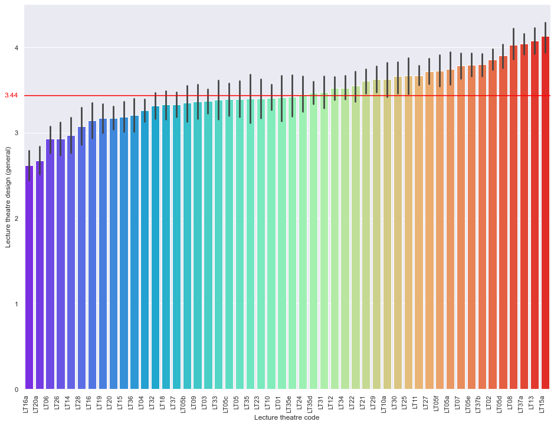

# Shehab_Portfolio
Two projects currently on GitHub. One Private Equity project in-progress. After Private Equity, a project will begin containing data collection through to production. 

# [Descriptive and Inferential Statistics To Determine Performance of Lecture Theatres in University](https://github.com/shehab-shahid/Descriptive_and_Inferential_Statistics_To_Determine_Performance_of_Lecture_Theatres_in_University)

* This is a real-life project that I completed using Excel in 2020 during my MSc and improved it using Python in 2021.
* The project used decriptive and inferential statistics on 3953 student questionnaires, received over 50 lectures to determine performance of lecture theatres as a learning environment. 
* Three types of data were analyzed: students properties (gender, clothing, seat position), students perception/KPI (thermal comfort, lecture theatre rating, etc.) and lecture theatre environmental and physical properties (mean temperature, room length etc.)
* The analysis identified the performance of lecture theatres and proposed improvements to few under-performing lecture theatres

## Code used

### Python version: 3.8.8
### Packages: pandas, numpy, scipy, seaborn, matplotlib, plotly, missingno

## Data

The data was provided by the university and required a lot of cleaning. 
There were mixed data types in columns that should be numerical, columns that needed to be deleted as those variables were not going to be analyzed, columns that needed consistent data ('F' for females not 'f' and 'F'), and, deleting values that are not expected in a variable.
Missing values were then visualized and it was found that the total number of empty cells were negligible. The following matrix represents the fullness of the data.

Missingno matrix where white cells represent missing data. Wire on the RHS shows most rows have all 50 columns filled, with the largest peak showing a row where only 36/50 columns are filled. All columns with student-entered data have missing values, most columns entered by the moderator are full.

## Descriptive Statistics

The following recommendations were proposed based on descriptive statistics:
* Overall the learning environment of 50 lecture theatres in University College London is impressive. In all KPI's, the data was skewed to favour high points.
* Best and worst performing lecture theatres were identified after their repeated positings in KPI's. Out of 30 lecture theatre features, only seat comfort, desk space, room length/width, mean room temperatures and light intensities presented some correlation, although, weak. The following recommendation is therefore provided to improve poor performing lecture theatres: seat width around 500 mm, desk depth around 325 mm, 750 mm desk height, lecture theatre length and width around 12.5 m, room height 2.5 m and 21-24.5 degrees Celsius of room temperature.
* The following figures summarize some of the statistics.

Barplot showing mean general design rating of each Lecture Theatre. The overall mean across all Lecture Theatres is highlighted in red, 3.44 (on a scale of 1 to 5)

Boxplot of seat widths depending on overall lecture theatre rating. Optimal width seems to be around 500 mm.

Students thermal comfort perception against mean room temperature during survey. The thermal comfort chart ranges from 1 (cold) to 4 (neutral) to 7 (hot). Optimal range to accomodate most students seems to be around 21-24.5 degrees Celsius

## Inferential Statistics

An independent, two-tailed t-test and a one-way ANOVA was carried out (all assumptions were justified), the following conclusions were reached:
* Male thermal perception had significantly higher values (4.11 ± 0.06 (no units)) compared to female thermal perception (3.93 ± 0.04 (no units)) (p-value < 0.05). This indicates that males felt more hotter compared to females during lectures. However, a thermal perception score of 4 indicates a neutral thermal sensation, which both means are close to.
*  There was no statistical evidence that thermal perception between the front, middle and back seated students differs as the p-value was slightly over 0.05 (0.06).

# [Mechanical Joint Simulation and Optimization](https://github.com/shehab-shahid/Mechanical_Joint_Simulation_Optimization)
* This is my undergrad thesis project from 2019 where I simulated a mechanical joint under load and optimized its stiffness to minimize internal stress
* The results of the gradient-based optimization algorithms amazed me and propelled my interest in digital technology
* Minimal coding was required in this project (loops, variables etc.) as optimization was built into the simulation software with its unique programming language (no MatLab or Python)
* Project repo contains [theoretical information](https://github.com/shehab-shahid/Mechanical_Joint_Simulation_Optimization/blob/main/Brief_Application_Theory/Optimization_Condensed_Report.ipynb) on how the objective function and optimization coefficients were formulated
* Below is a dashboard summarizing the project

