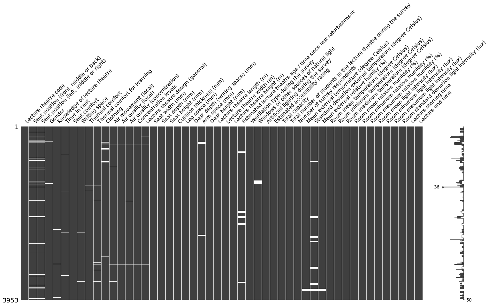

# Shehab_Portfolio
Three projects currently on GitHub.

* The first project (Mechanical Joint Simulation and Optimization, BEng thesis), was my first experience with Data Science that made me immediately realize it's power and potential (please see dashboard at end of webpage). 

* The second project consists of Diagnostic, Prescriptive and Inferential Analysis using Python on data that included performance of lecture halls and student perceptions. 

* In the third project, I applied Diagnostic Analysis and Forecasting on financial datasets using Python. 

Following Data Analysis projects in Python, I am now furthering my Data Analyst skills in SQL and will then move onto Data Science and Engineering topics.

The following projects are now underway: 
 
* Scrape any website
* Project containing Machine Learning (Multiple Linear Regression) and production
* Google Intro To Data Structures and Algorithms Certificate
* IBM Data Engineering Certificate
* Financial modelling and valuation (non-data science)

# [Forecasting Sales and Identifying Anomalies in Journals for Private Equity Investment](https://github.com/shehab-shahid/Forecasting_Sales_And_Identifying_Anomalies_In_Journals_For_Private_Equity_Invesment)

* This project was part of the Institute of Chartered Accountants in England and Wales (ICAEW) Private Equity (Data Analyst) course.
* A Private Equity firm is looking to invest in SuperStore, an international retailer that offers office supplies, furniture and technology. The firm wants to use Data Science to assess SuperStore's financial performance and management controls.
* The project used Python to identify any anomalous journal entries and whether segregation of duties in journal entries exists. It was found that management controls were breached only a few times.
* The financial performance required forecasting profits (using ARIMA) for the next four years across all regions to see if the net profit on sales increases by 10% annually, this condition was met as the forecast indicated a growth of 24%. Non-profitable regions (Western Africa) were identified and it was found that reducing the high value of discounts could turn these into a profitable region. Among the products, Tables have the highest discounts applied which leads to negative profits. The customer base of SuperStore is constant throughout the years, which indicates strong loyalty from existing customers, however, new customers should also be sought through marketing campaigns.
* A [Tableau dashboard](https://public.tableau.com/app/profile/shehab.shahid/viz/SuperStore_16453569346800/SuperStoreDashboard) is also available which shows global profits by County and products analysis.
* Overall, SuperStore only needs to address its management controls in order to acquire investment from the Private Equity firm.
* The following figure showcases the profits forecast (RMSE: 9741).

## Code used

### Python version: 3.8.8
### Packages: pandas, numpy, seaborn, matplotlib

## Data
The sales data was obtained from SuperStore (2016-2019), which is available from Tableau or Kaggle online. The Journals dataset was provided by ICAEW and is not available online. Only snippets of the dataset can be viewed in the Jupyter notebooks within this repo.

The sales dataset had missing values which were found and replaced from data within the dataset itself. The Journals dataset required merging and appending with the Accounts Team Staff dataset. Overall, both datasets were 100% complete.

There are three Jupyter Notebooks in this repo. Wrangling contains the data cleaning process. EDA consists of examining management controls and diagnostic analysis of sales. Profits Predictive Modelling contains the ARIMA model setup.

# [Diagnostic, Prescriptive and Inferential Analysis To Determine Performance of Lecture Theatres in University](https://github.com/shehab-shahid/Diagnostic_and_Inferential_Analysis_To_Determine_Performance_of_Lecture_Theatres_in_University)

* This is a real-life project that I completed using Excel in 2020 during my MSc and improved it using Python in 2021.
* The project used Diagnostic, Prescriptive and Inferential Analysis on 3953 student questionnaires, received over 50 lectures to determine performance of lecture theatres as a learning environment. 
* Three types of data were analyzed: students properties (gender, clothing, seat position), students perception/KPI (thermal comfort, lecture theatre rating, etc.) and lecture theatre environmental and physical properties (mean temperature, room length etc.)
* The analysis identified the performance of lecture theatres and proposed improvements to few under-performing lecture theatres

## Code used

### Python version: 3.8.8
### Packages: pandas, numpy, scipy, seaborn, matplotlib, plotly, missingno

## Data

The data was provided by the university and required a lot of cleaning. 
There were mixed data types in columns that should be numerical, columns that needed to be deleted as those variables were not going to be analyzed, columns that needed consistent data ('F' for females, not 'f' and 'F'), and, deleting values that are not expected in a variable.
Missing values were then visualized and it was found that the total number of empty cells were negligible. The following matrix represents the fullness of the data.

Missingno matrix where white cells represent missing data. Wire on the RHS shows most rows have all 50 columns filled, with the largest peak showing a row where only 36/50 columns are filled. All columns with student-entered data have missing values, most columns entered by the moderator are full.

## Diagnostic and Prescriptive Analysis

The following recommendations were proposed based on the analysis:
* Overall the learning environment of 50 lecture theatres in University College London is impressive. In all KPI's, the data was skewed to favour high points.
* Best and worst performing lecture theatres were identified after their repeated positioning in KPI's. Out of 30 lecture theatre features, only seat comfort, desk space, room length/width, mean room temperatures and light intensities presented some correlation, although, weak. The following recommendation is therefore provided to improve poor performing lecture theatres: seat width around 500 mm, desk depth around 325 mm, 750 mm desk height, lecture theatre length and width around 12.5 m, room height 2.5 m and 21-24.5 degrees Celsius of room temperature.
* The following figures summarize some of the statistics.

Barplot showing mean general design rating of each Lecture Theatre. The overall mean across all Lecture Theatres is highlighted in red, 3.44 (on a scale of 1 to 5)

Boxplot of seat widths depending on overall lecture theatre rating. Optimal width seems to be around 500 mm.

Students thermal comfort perception against mean room temperature during survey. The thermal comfort chart ranges from 1 (cold) to 4 (neutral) to 7 (hot). Optimal range to accomodate most students seems to be around 21-24.5 degrees Celsius

## Inferential Statistics

An independent, two-tailed t-test and a one-way ANOVA was carried out (all assumptions were justified), the following conclusions were reached:
* Male thermal perception had significantly higher values (4.11 ± 0.06 (no units)) compared to female thermal perception (3.93 ± 0.04 (no units)) (p-value < 0.05). This indicates that males felt more hotter compared to females during lectures. However, a thermal perception score of 4 indicates a neutral thermal sensation, which both means are close to.
*  There was no statistical evidence that thermal perception between the front, middle and back seated students differs as the p-value was slightly over 0.05 (0.06).

# [Mechanical Joint Simulation and Optimization](https://github.com/shehab-shahid/Mechanical_Joint_Simulation_Optimization)
* This is my undergrad thesis project from 2019 where I simulated a mechanical joint under load and optimized its stiffness to minimize internal stress
* The results of the gradient-based optimization algorithms amazed me and propelled my interest in digital technology
* Minimal coding was required in this project (loops, variables etc.) as optimization was built into the simulation software with its unique programming language (no MatLab or Python)
* Project repo contains [theoretical information](https://github.com/shehab-shahid/Mechanical_Joint_Simulation_Optimization/blob/main/Brief_Application_Theory/Optimization_Condensed_Report.ipynb) on how the objective function and optimization coefficients were formulated
* Below is a dashboard summarizing the project

